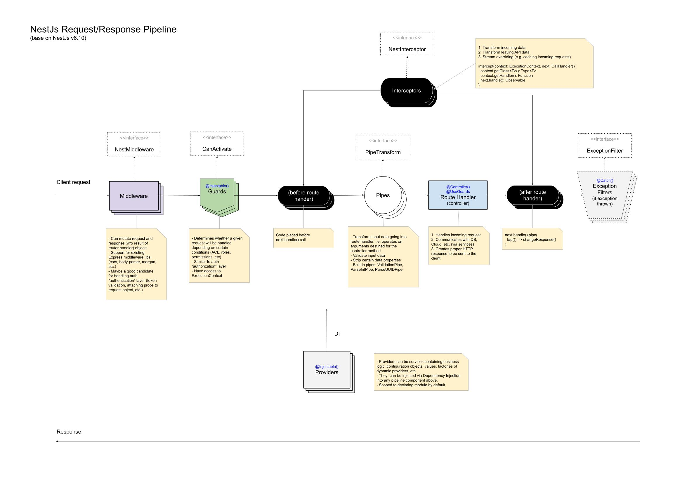

# COURSE-MANAGEMENT-SYSTEM

## Architecture



---

## Postman Collection

[Please download postman collection here](docs/postman-collection/cms.postman_collection_24_nov_2022.json)

---

## Installation

### Database setup & .env file

1. Copy `.env.sample` to same location and rename it to `.env`
2. In the `.env` file, update your database URL and make sure you have created database

### Install Packages

```bash
npm install
```

### Build Project

```bash
npm run build
```

### Database Migration

```bash
npm run prisma:migrate
```

### Seed database

```bash
npm run prisma:seed
```

---

## Running the app

```bash
# development
$ npm run start

# watch mode
$ npm run start:dev

# production mode
$ npm run start:prod
```

---
